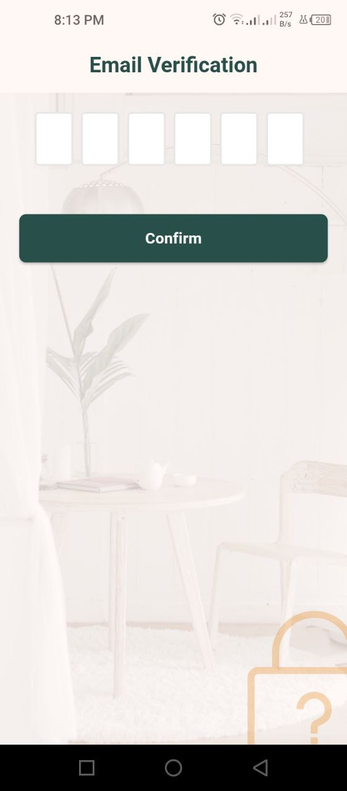

# User UI




<figure><figcaption></figcaption></figure> <figure><figcaption></figcaption></figure>





<figure><figcaption></figcaption></figure> <figure><figcaption></figcaption></figure> <figure><figcaption></figcaption></figure> <figure><figcaption></figcaption></figure> <figure><figcaption></figcaption></figure>





<figure><figcaption></figcaption></figure> <figure><figcaption></figcaption></figure> <figure><figcaption></figcaption></figure>






<figure><figcaption></figcaption></figure>




<figure><figcaption></figcaption></figure> <figure><figcaption></figcaption></figure>





<figure><figcaption></figcaption></figure> <figure><figcaption></figcaption></figure> <figure><figcaption></figcaption></figure> <figure><figcaption></figcaption></figure>





<figure><figcaption></figcaption></figure> <figure><figcaption></figcaption></figure>





<figure><figcaption>
AR Core
</figcaption></figure> <figure><figcaption>
My Web AR
</figcaption></figure>







<figure><figcaption></figcaption></figure> <figure><figcaption></figcaption></figure> <figure><figcaption></figcaption></figure> <figure><figcaption></figcaption></figure> <figure><figcaption></figcaption></figure>





<figure><figcaption></figcaption></figure> <figure><figcaption></figcaption></figure> <figure><figcaption></figcaption></figure> <figure><figcaption></figcaption></figure> <figure><figcaption></figcaption></figure>





<figure><figcaption></figcaption></figure> <figure><figcaption></figcaption></figure> <figure><figcaption></figcaption></figure>





<figure><figcaption></figcaption></figure> <figure><figcaption></figcaption></figure>






<figure><figcaption></figcaption></figure>




<figure><figcaption></figcaption></figure>



